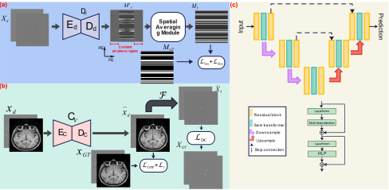

# <p align=center>`A Physics-Informed Deep Learning Framework for Brain MRI Motion Artifact Correction`</p> # 


[](https://opensource.org/licenses/MIT)


:fire::fire:**PI-MoCoNet** is a deep learning framework designed to robustly remove motion artifacts in brain MRI images by integrating complementary information from both the spatial and *k*-space domains. 

- Our paper on arXiv: [A Physics-Informed Deep Learning Framework for Brain MRI Motion Artifact Correction](https://arxiv.org) :heart:


## 🔄 Flowchart Overview

The following flowchart illustrates the architecture of **PI-MoCoNet**:

<p align="center">
  
</p>


## Getting Started

**⚠️ *Important:* The code for this study will be released publicly <span style="color:red;">  upon acceptance </span>of the manuscript .**
### Prerequisites

- Python (>=3.12)
- PyTorch (>=2.5)
- NVIDIA CUDA (for GPU acceleration)
- Additional dependencies as listed in `requirements.txt`

### Installation

1. **Clone the repository:**

   ```bash
   git clone https://github.com/mosaf/PI-MoCoNet.git
   cd PI-MoCoNet
   
2. **Install dependencies:**

    ```bash
    pip install -r requirements.txt


## Project Structure

```

```bash
├── data_preparation
│   ├── main_preperation.py  (load .nii files, perform motion simulation and save them to .h5 file)
│   ├── motion_simulation2D.py
├── datasets
│   ├── data_loader.py
├── losses
│   ├── losses.py (contain DC and Dice loss functions)
├── networks
│   ├── seg_net.py (motion detection network)
│   ├── unet_swin.py (motion correction network)
│   ├── swin_transformer.py
│   ├── fp16_util.py
│   ├── basic_ops.py
├── build.py
├── main.py
└── utils.py
```


## Running the Code

To run the project, modify the parameters in the `main.py` file and execute the `main.py` script:

```bash
python main.py
```


## 📚 Citation

If you find **PI-MoCoNet** useful for your research or project, please consider citing our work:

<pre>
@article{mojtaba2025physicsinformed,
  title     = {A Physics-Informed Deep Learning Model for MRI Brain Motion Correction},
  author    = {Mojtaba Safari, Shansong Wang, Zach Eidex, Xiofeng Yang},
  journal   = {Journal Name},
  year      = {2025},
  publisher = {Publisher},
  doi       = {10.xxxx/xxxxxxxx},

}
</pre>


